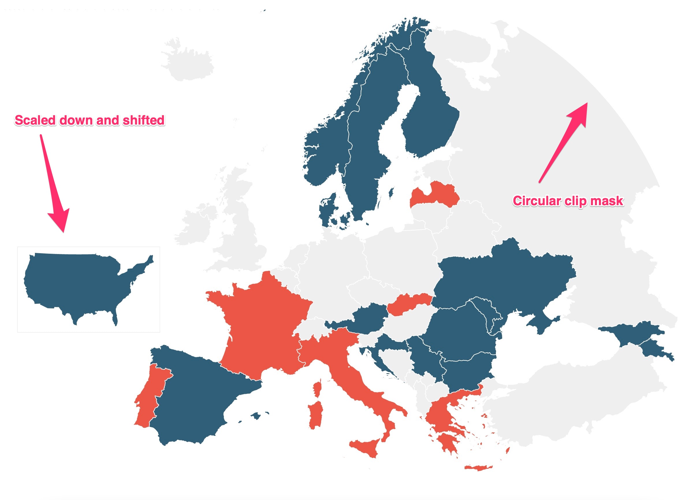

# Map preprocessing
These steps create a TopoJSON file that includes European countries, with Russia nicely cut off and the USA scaled and shifted.

Take a look at the `makefile` for all the steps.



## In short
```bash
make prepare
```

Copy the coordinates to `clip.js`.

```bash
make edit
```